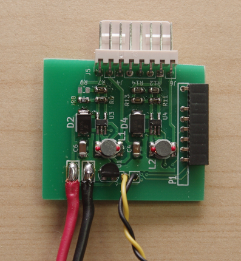
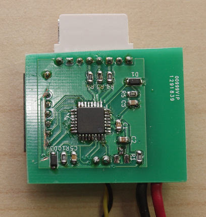
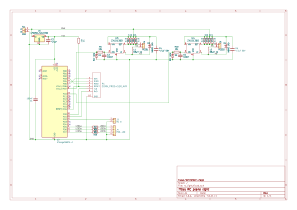

# Light controller for RC model planes

This repository contains hardware and firmware for a light controller for RC model planes.
It has two channels for high-power LEDs (intended for anti-collision light (ACL) and
landing light) and 3 outputs for standard LEDs (intended for navigation lights).
The lights can be controlled remotely with a standard servo signal.
The circuit is powered directly from the drive battery to make powering the high-power LEDs
as efficient as possible. An LP2950 voltage regulator generates the 5V for the MCU.
The project uses an ATmega microcontroller. As high-power LED driver, the Zetec ZXLD1360
(or its pin-compatible successor ZXLD 1362) are used.
Debug output can be enabled through the USART of the chip.

You need to adjust the current control resistors (R6 to R9 and R11 to R13) to match the correct
current of your respective high-current LED according to the
[datasheet of the ZXLD1360](https://www.diodes.com/assets/Datasheets/ZXLD1360.pdf),
section "Setting nominal average output current with external resistor Rs".
Also check that the pre-resistors of the standard LEDs (R2 to R4).

The project uses git submodules. Remember to initialise and update the submodules recursively,
since also submodules of submodules are used.

The project is licensed under the [GNU affero general public license](LICENSE).
